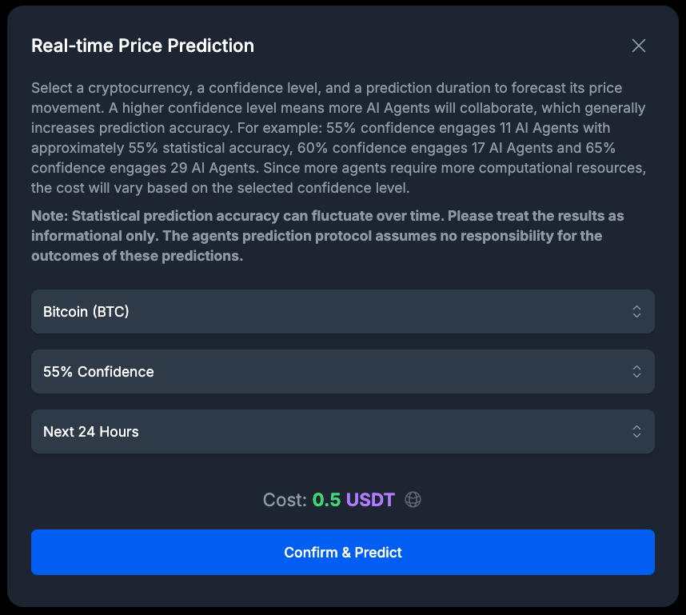
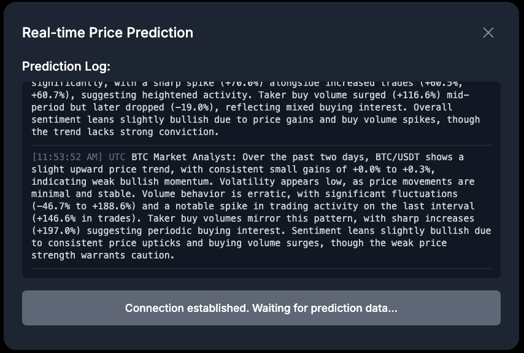
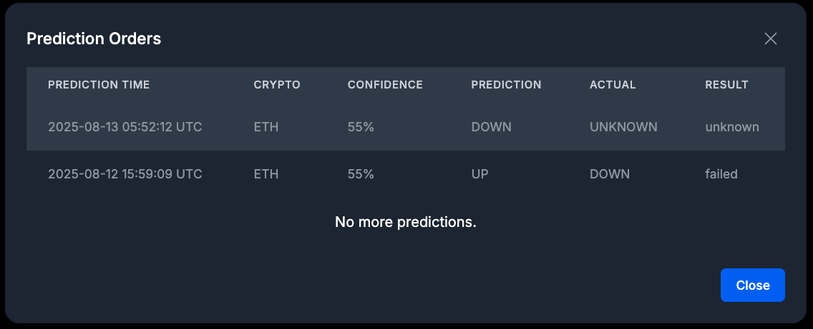

## How to Make a Adhoc Prediction

Once your wallet is connected, you can start making predictions.

1.  **Open the Prediction Dialog:** Click on the main **"Get more price predictions with a one-time payment"** button to open the prediction settings dialog.

2.  **Select Cryptocurrency:** Choose the cryptocurrency you want to predict from the dropdown list.

3.  **Choose Confidence Level:** Select a confidence level for your prediction. A higher confidence level engages more AI agents to analyze the data, which increases the potential accuracy but also costs more. The cost for each level is displayed next to the option.

4.  **Select Duration:** Choose the time frame for the prediction (e.g., Next 24 Hours).

5.  **Confirm and Pay:** The cost for the prediction will be displayed in the specified token (e.g., USDT). 
    *   If this is your first time or you haven't approved the token spending, you will first need to click **Approve**. This is a one-time transaction per wallet that allows the smart contract to accept your tokens as payment.
    *   Once approved, click **Confirm & Predict** to submit the payment transaction. You will need to confirm this in your wallet.

6.  **View Real-time Log:** After your transaction is confirmed, a real-time log will appear, showing the progress of the AI agents as they work on your prediction. Please do not close the dialog during this process.

7.  **Receive Your Result:** When the prediction is complete, the **Prediction Result** dialog will automatically open, showing you the detailed outcome.

## Viewing Your Predictions

You can view your entire prediction history at any time.

### Prediction History

Click on the **"Prediction Orders"** button (or similar) to open a dialog listing all of your past predictions. This list is scrollable, and more orders will load as you scroll to the bottom.

### Understanding the Results

Whether you have just completed a new prediction or are viewing a past one, the **Prediction Result** dialog will provide you with detailed information, split into two main sections:

#### Prediction Data
This section contains all the input parameters and metadata for your prediction:
-   **Confidence Level:** The confidence level you selected.
-   **User Address:** Your wallet address.
-   **Cryptocurrency:** The asset you made a prediction for.
-   **Duration:** The time frame for the prediction.
-   **Payment Transaction:** The hash of your payment transaction. Click the icon next to it to view the transaction on a block explorer.
-   **Session ID:** A unique identifier for this specific prediction.
-   **Engaged AI Agents:** The number of AI agents used.
-   **Run Time:** The total time it took to generate the prediction.

#### Prediction Result
This section shows the outcome of the prediction:
-   **Predicted Movement:** The forecasted price trend (UP or DOWN), shown with a corresponding icon.
-   **Actual Movement:** The actual price trend after the prediction period ended. This will show as "Unknown" for in-progress or recent predictions.
-   **Outcome:** The final result (e.g., WIN, LOSS), shown with a corresponding icon.
-   **Start Price:** The price of the asset at the time the prediction was made.
-   **Prediction Time:** The UTC date and time when the prediction was initiated.
-   **Verify Time:** The UTC date and time when the prediction outcome was verified.