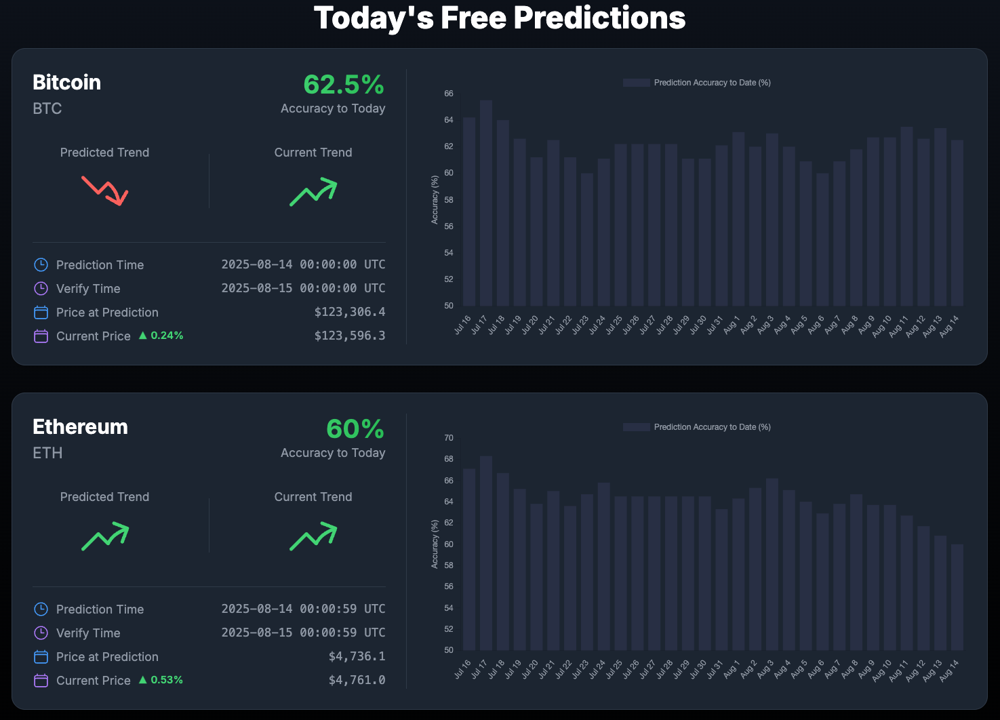

Each day, the platform provides free predictions for major cryptocurrencies. Currently, BTC and ETH predictions at 60% confidence are available daily. Our backend service will start the free prediction routines at 00:00 UTC everyday. But, because AI agents running need times and each cryptocurrency predict one by one, so the prediction time is not exactly at 00:00 UTC, you can check the start time of prediction by "Prediction Time" field.

Key fields for each cryptocurrency prediction include:
- **Predicted Trend** – The predicted price movement generated by AI agents. Possible trends: UP or DOWN.
- **Current Trend** – The real-time trend based on the price at prediction and the current price. This may change over time and is not a final result.
- **Prediction Time** – The timestamp when the prediction was generated.
- **Verify Time** – The time after which the prediction result can be verified.
- **Price at Prediction** – The cryptocurrency price when the prediction was made.
- **Current Price** – The current price of the target cryptocurrency.

Additionally, we provide a chart illustrating the historical cumulative prediction accuracy over the past 30 days, showing how it has fluctuated over time.