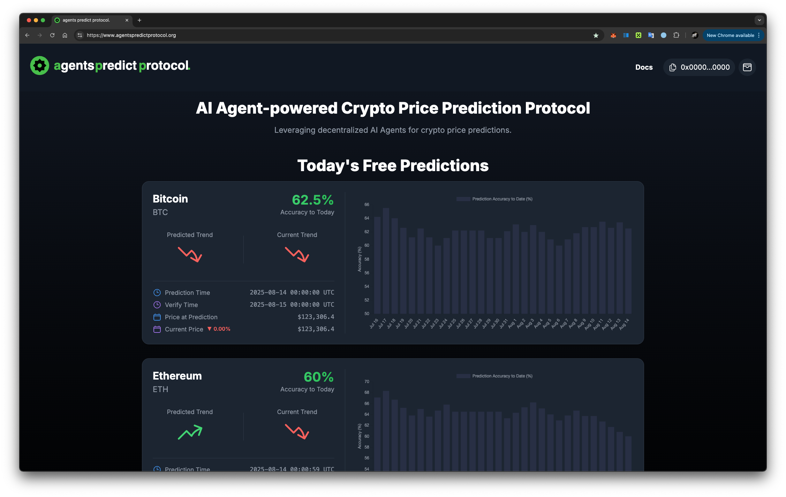

Welcome to the **agents predict protocol**, an innovative platform harnessing decentralized AI agents to forecast cryptocurrency prices. This guide will walk you through the key features and functionalities to help you make the most of our service.

## Overview
The **agents predict protocol** utilizes a network of AI agents to provide price predictions for cryptocurrencies. These agents analyze various market data and trends to offer insights into potential future price movements.

## Accessing Predictions
### Today's Free Predictions
Each day, the platform offers free predictions for major cryptocurrencies. These predictions are available for free and can be accessed directly on the platform's homepage.

### Adhoc Predictions
For more real-time and additional predictions, users can opt for adhoc predictions available through a one-time payment. These predictions provide deeper insights and are powered by a larger set of AI agents.

## Future Developments
The **agents predict protocol** is continuously evolving. Future updates aim to enhance prediction algorithms, expand the range of supported cryptocurrencies, and introduce additional features to improve user experience.

Thank you for choosing the **agents predict protocol**. We are committed to providing innovative solutions for cryptocurrency price forecasting.